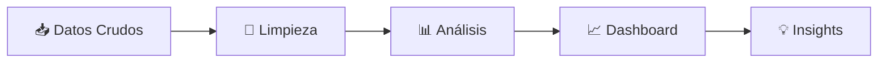

<h1 align="center">📊 Cristian Aguirre</h1>

<p align="center">
  
</p>

<p align="center">
  
  
  
</p>

---

## 🚀 Sobre mí

💡 Analista de Datos con fuerte experiencia en:

* 📊 Diseño de KPIs y métricas de negocio
* 📈 Creación de dashboards ejecutivos
* 🧠 Análisis de datos para toma de decisiones
* ⚙️ Optimización de procesos mediante datos

📌 Mi objetivo: **convertir datos en impacto real en el negocio**

---

## ⚡ Stack Tecnológico

### 🧠 Lenguajes & Data

<p align="center">
  
  
</p>

<p align="center">
  
  
</p>

---

### 📊 BI & Visualización

<p align="center">
  
  
</p>

---

### ⚙️ Herramientas & Plataformas

<p align="center">
  
  
  
</p>

---

## 📊 Visualización de Skills

<p align="center">
  
</p>


## 📊 Flujo de Trabajo



---

## 📂 Proyectos Destacados

### 🏡 Airbnb Analytics (Power BI)

📊 Análisis de precios y ocupación

✔ +35% variación en precios por temporada
✔ Identificación de zonas más rentables

---

### 🧪 Customer Behavior (Python)

📊 Análisis exploratorio de datos

✔ Segmentación de clientes
✔ Detección de patrones de compra

---

### 🧩 SQL Business Analysis

📊 Análisis orientado a negocio

✔ Top productos
✔ Retención de clientes
✔ Distribución de ingresos

---

## 📈 Impacto en Negocio

```diff
+ Reducción de tiempos de procesamiento mediante KPIs
+ Mejora en la toma de decisiones basada en datos
+ Optimización de procesos operativos
```

---

## 📈 GitHub Analytics

<p align="center">
 
</p>


---

## 🧠 Habilidades Clave

<p align="center">
  
  
  
  
</p>

---

## 📬 Contacto

📧 [dev.aguirrecristian@gmail.com](mailto:dev.aguirrecristian@gmail.com)
📍 Buenos Aires, Argentina

---

## 🎯 Objetivo

🚀 Busco oportunidades como **Analista de Datos Junior** para generar impacto con datos y seguir creciendo profesionalmente.

---

<p align="center">
  ⭐ Si te interesa mi perfil, explorá mis proyectos y conectemos
</p>


